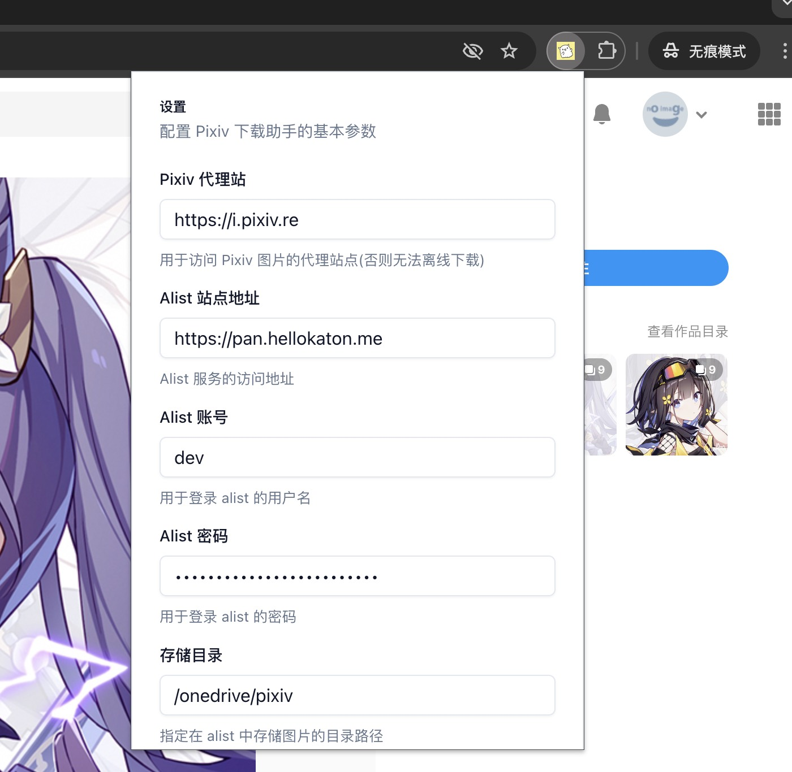
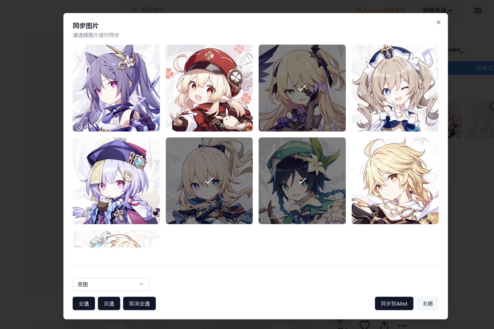
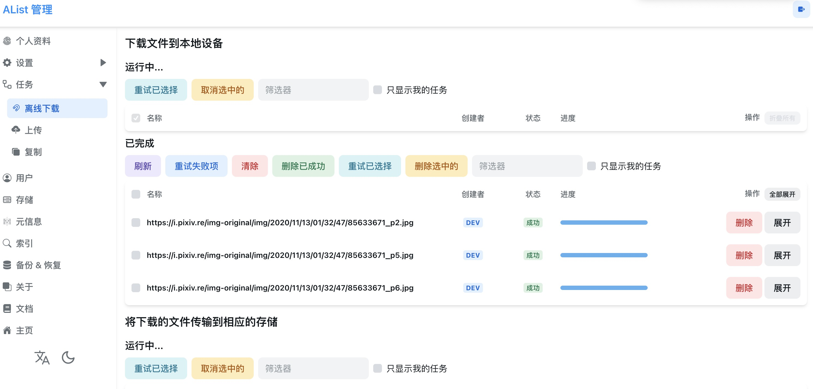

# Pixvi-Helper - A Chrome Extension for Pixiv Illustrations 🎨

[English](README.md) | [简体中文](README_zh.md)

A Chrome extension built with WXT and shadcn/ui that helps you download and sync Pixiv illustrations to your cloud storage through Alist. Download your favorite artworks in different quality options and manage them effortlessly.

## 📸 Preview






## ✨ Features

- 🖼️ Download Pixiv illustrations with one click
- 📊 Multiple quality options (High-quality, Standard)
- ☁️ Sync downloads to cloud storage via Alist
- 💾 Support various storage backends (Google Drive, OneDrive, etc.)
- 🎯 Responsive and intuitive user interface
- ⚡ Fast and efficient downloads
- 🔒 Local configuration storage for privacy

## 🛠️ Tech Stack

- **Framework**: React + TypeScript
- **Extension Framework**: WXT (WebExtension Tools)
- **UI Components**: shadcn/ui
- **Styling**: Tailwind CSS
- **Icons**: Lucide React
- **State Management**: React Hooks
- **Storage Integration**: Alist API

## 🚀 Getting Started

1. Clone the repository: `git clone https://github.com/hellokaton/pixiv-helper.git`
2. Install dependencies:

```bash
pnpm install
```

3. Start development server:

```bash
pnpm dev
```

This will automatically:

- Start the development server
- Open Chrome with the extension loaded
- Enable hot reload for development

## 🔧 Configuration

The extension can be configured through the popup settings panel:

- Alist server configuration
- Download quality preferences
- Storage backend selection
- Download path settings

## 💡 Usage

### Installation

You have two ways to install this extension:

1. **Chrome Web Store**

   - Visit the Chrome Web Store（Under Review）
   - Click "Add to Chrome" to install

2. **Manual Installation**
   - Download the latest release from [GitHub Releases](https://github.com/hellokaton/pixiv-helper/releases)
   - Unzip the downloaded file
   - Open Chrome and go to `chrome://extensions/`
   - Enable "Developer mode" in the top right
   - Click "Load unpacked" and select the unzipped folder

### Setup and Use

1. After installation, click the extension icon in Chrome
2. Configure your Alist server settings
3. Browse Pixiv and use the download button to save illustrations
4. Select your preferred quality
5. The extension will automatically sync downloads to your cloud storage

## 🤝 Contributing

Contributions are welcome! Please feel free to submit a Pull Request.

## 📝 License

This project is licensed under the MIT License - see the [LICENSE](LICENSE) file for details.

## 🙏 Acknowledgments

- Built with [WXT](https://wxt.dev)
- UI components from [shadcn/ui](https://ui.shadcn.com)
- Icons from [Lucide](https://lucide.dev)
- [Alist](https://alist.nn.ci) for cloud storage integration
